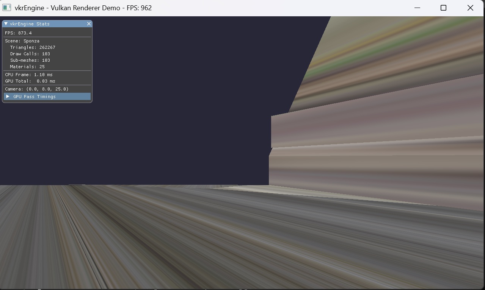
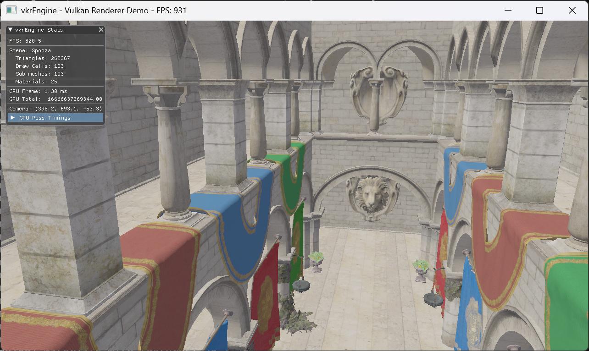

# Phase 1: 基础设施 + 场景加载 — 开发日志

**日期**: 2026-05-30
**状态**: ✅ 完成

---

## 1. 最终基线数据

| 指标               | 数值    |
| ------------------ | ------- |
| 场景三角形数       | 262,267 |
| Sub-meshes         | 103     |
| Draw Calls         | 103     |
| 材质（已加载纹理） | 25 / 25 |
| FPS (Debug)        | ~900    |

## 2. 架构决策（摘要）

| 决策       | 选择                                                   |
| ---------- | ------------------------------------------------------ |
| 场景格式   | glTF 2.0 (tinygltf)                                    |
| 顶点布局   | pos(0) + normal(12) + texCoord(24), stride=48 (硬编码) |
| 渲染方式   | Dynamic Rendering (Vulkan 1.3)                         |
| Descriptor | Set0: SceneUBO / Set1: image(b0)+sampler(b1)           |

---

## 3. 完整的 Bug 调试记录（共 12 个）

> 每个 bug 记录：症状 → 可能原因 → RenderDoc 调试方法 → 根因 → 修复

### Bug #1: 纹理加载崩溃

**症状**: 启动时崩溃 `failed to load texture image: .../5061699253647017043.png`

**定位**: `VulkanBase::LoadTextureFromFile()` 内部用 `stbi_load((VK_TEXTURE_DIR + path).c_str())` 拼接路径 — 即总是在路径前加 `assets/textures/` 前缀。Sponza 的纹理在 `assets/glTF-Sample-Assets-main/Models/Sponza/glTF/`，导致实际查找路径变成 `assets/textures/E:/.../Sponza/glTF/5061699253647017043.png`。

**修复**: 重写 `VkrRenderer::loadMaterialTexture()`，直接用 `stbi_load(fullPath.c_str())` 加载绝对路径，然后手动创建 Vulkan 图像资源（`createImage` + `copyBufferToImage` + `generateMipmaps`）。

---

### Bug #2: Validation Layer 报 `vkCmdPipelineBarrier2 before vkBeginCommandBuffer`

**症状**: Validation layer 警告 command buffer 不在 recording state 时调用了 barrier。

**定位**: `recordCommandBuffer()` 中直接调用了 `gpuProfiler.beginFrame()` 和 `transition_image_layout()`，但从未调用 `cmd.begin()` 开启 command buffer recording。

**修复**: 在 `recordCommandBuffer()` 开头添加 `cmd.begin(vk::CommandBufferBeginInfo{})`，结尾添加 `cmd.end()`。

---

### Bug #3: `Set 0 Binding 1 "globalParams"` — push constant 被误编译为 descriptor

**症状**: `vkCreateGraphicsPipelines: descriptor [Set 0, Binding 1, variable "globalParams"] not declared in VkPipelineLayoutCreateInfo`

**定位**: Slang 中 `[[vk::push_constant]] uniform float4x4 modelMatrix` 语法不正确，Slang 将 `uniform` 修饰的变量解释为 UBO 而非 push constant。

**修复**: 改为 Slang 标准的 push constant struct 语法：
```slang
struct PushBlock { float4x4 modelMatrix; };
[[vk::push_constant]] PushBlock push;
```

---

### Bug #4: `ImGui context not created!`

**症状**: `initUI()` 检测不到 ImGui context 导致 `prepareResource` 失败。

**定位**: `VulkanBase::initVulkanUI()` 是 member function（包装了 free function `::initVulkanUI(this)`），需要在 subclass 中显式调用。之前的代码错误地认为它已在 `VulkanBase::initVulkan()` 中被调用。

**修复**: `VkrRenderer::initUI()` 直接调用 `return initVulkanUI()`。

---

### Bug #5: `vkFreeDescriptorSets: missing FREE_DESCRIPTOR_SET_BIT`

**症状**: `vk::raii::DescriptorSet` 析构时调用 `vkFreeDescriptorSets` 但 pool 缺少 `VK_DESCRIPTOR_POOL_CREATE_FREE_DESCRIPTOR_SET_BIT`。

**修复**: 创建 DescriptorPool 时添加 `.flags = vk::DescriptorPoolCreateFlagBits::eFreeDescriptorSet`。

---

### Bug #6: Material descriptor sets 所有权问题

**症状**: 从 `vk::raii::DescriptorSets` 批量分配后逐个 `std::move` 元素到 `materialDescriptorSets`，导致 RAII wrapper 析构时尝试释放已移动的 handle。

**修复**: 改为逐个单独分配 descriptor set（每次只分配 1 个），避免批量分配时的所有权混乱。

---

### Bug #7: 纹理全是白色（缺 imageView）

**症状**: 画面只有零碎的白色面片，Materials with textures: `0 / 25`。

**定位**: 输出纹理加载信息，发现所有纹理都正确加载了，所以可能是没有用上。

**修复**: `loadMaterialTexture()` 里创建了 image + memory，但忘了 `createImageView()`。添加 `tempTex.textureImageView = createImageView(...)`。

---

### Bug #8: Slang sampler binding 自动分配到 Set0 Binding0

**症状**: `descriptor type mismatch` — sampler 占用了 SceneUBO 的位置。

**定位**: 去掉 sampler 的显式 `[[vk::binding]]` 后，Slang 自动选 Set0 Binding0。

**修复前 (scene_frag.slang)**:
```slang
// ❌ sampler 没有显式 binding — Slang 自动分配到 Set0 Binding0 导致冲突
[[vk::binding(0, 1)]] Texture2D baseColorTexture;
SamplerState baseColorSampler;
```

**修复后 (scene_frag.slang)**:
```slang
// ✅ 分离绑定 — image 和 sampler 各有独立 binding
[[vk::binding(0, 1)]] Texture2D    baseColorTexture;
[[vk::binding(1, 1)]] SamplerState baseColorSampler;
```

**修复后 (VkrRenderer.cpp descriptor layout)**:
```cpp
// 从 CombinedImageSampler 改为分离的 SampledImage + Sampler
{{.binding = 0, .descriptorType = vk::DescriptorType::eSampledImage, ... },
 {.binding = 1, .descriptorType = vk::DescriptorType::eSampler,      ... }},
```

---

### Bug #9: 远裁剪面太近，看不出任何形状

**症状**: 到处都是破碎面片。Mesh Viewer VS Out 能看到大致轮廓。


**RenderDoc 调试 — VS Out**: `worldPos` 值很远（~530），但 far plane = 100。

**修复**: far plane → 2000。

---

### 🔑 Bug #10: 顶点偏移被加了两次（最关键）

**症状**: "大致能看出轮廓，但三角面很杂乱，且纹理把拉伸"。VS Out 顶点位置正确，画面却很乱。


**分析**: 顶点位置正确 + 画面乱，说明索引有问题。

**RenderDoc 调试 — Buffer Viewer**:
1. Pipeline State → IA → 确认 index buffer format = `UINT32`
2. **Buffer Viewer** → 查看 index buffer 内容
3. 索引值如 `3708, 3709, 3710...` — 已是全局偏移后的值
4. 但 `drawIndexed(count, 1, firstIndex, vertexOffset, 0)` 里又传了 `vertexOffset`
5. GPU 实际用 `indexBuf[idx] + vertexOffset = 3708 + 3708 = 7416` ，也就是说完全错位了

**根因**: 加载时 `indices.push_back(baseVertex + gltfIdx)` 已全局化，渲染时又加了一次 vertexOffset。

**修复**: `drawIndexed(..., vertexOffset = 0)`。

---

## 4. 截图



## 5. 下一步 

Phase 2: PBR + IBL（引入基于物理的渲染和环境光照）
