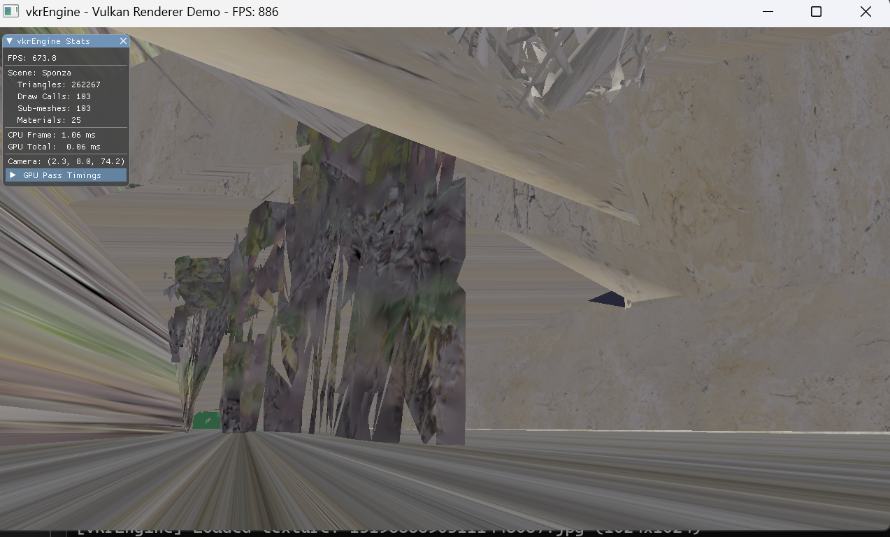
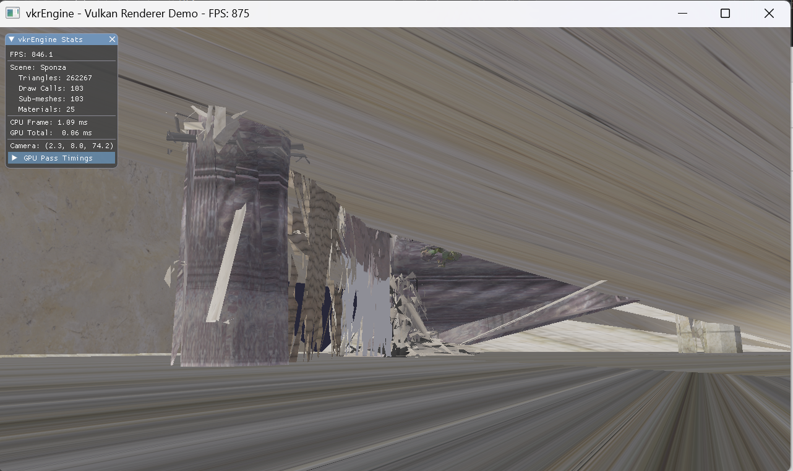

# Phase 1: 基础设施 + 场景加载 — 开发日志

## 1. 场景

| 指标               | 数值    |
| ------------------ | ------- |
| 场景三角形数       | 262,267 |
| Sub-meshes         | 103     |
| Draw Calls         | 103     |
| 材质（已加载纹理） | 25 / 25 |
| FPS (Debug)        | ~900    |

## 2. 数据

| 决策       | 选择                                                   |
| ---------- | ------------------------------------------------------ |
| 场景格式   | glTF 2.0 (tinygltf)                                    |
| 顶点布局   | pos(0) + normal(12) + texCoord(24), stride=48 (硬编码) |
| 渲染方式   | Dynamic Rendering (Vulkan 1.3)                         |
| Descriptor | Set0: SceneUBO / Set1: image(b0)+sampler(b1)           |

---

## 3. Bug 调试记录

### Bug #1: 纹理加载
启动时报错 `failed to load texture image: .../5061699253647017043.png`。

#### 猜测
纹理路径错了。Sponza 的 glTF 引用相对路径纹理，但代码在某处加上了前缀。

#### 追踪
`VulkanBase::LoadTextureFromFile()` 内部：
```cpp
// 实际执行: stbi_load("assets/textures/" + "E:/.../Sponza/glTF/tex.png")
// 结果: "assets/textures/E:/.../Sponza/glTF/tex.png" — 路径完全错误
```
始终在路径前拼接 `assets/textures/`，而 Sponza 纹理在模型目录下的绝对路径。

#### 修复
重写 `VkrRenderer::loadMaterialTexture()`，用 `stbi_load(fullPath.c_str())` 直接加载绝对路径，然后手动创建 Vulkan 图像资源（`createImage` + `copyBufferToImage` + `generateMipmaps`）。

---

### Bug #2: Slang sampler binding 自动分配到 Set0 Binding0

#### 问题
`descriptor type mismatch` — sampler 占用了 SceneUBO 的位置。

#### 猜测
Sampler 没有显式声明 binding，Slang 自动分配了 Set0 Binding0。

#### 追踪
原代码：
```slang
[[vk::binding(0, 1)]] Texture2D baseColorTexture;
SamplerState baseColorSampler;  // 无显式 binding —— Slang 自动选 Set0 B0
```

#### 修复
改为显式分离绑定：
```slang
// shader 端:
[[vk::binding(0, 1)]] Texture2D    baseColorTexture;
[[vk::binding(1, 1)]] SamplerState baseColorSampler;
```
```cpp
// C++ descriptor layout 端:
{.binding = 0, .descriptorType = vk::DescriptorType::eSampledImage, ...},
{.binding = 1, .descriptorType = vk::DescriptorType::eSampler,      ...},
```
---

### Bug 3: 顶点偏移被加了两次（最关键）

#### 问题


大致能看出轮廓，但三角面很杂乱，纹理被拉伸。VS Out 顶点位置正确，画面却很乱。

#### 猜测
**索引有问题**。

#### RenderDoc 调试 -> Buffer Viewer
1. Pipeline State -> IA -> 确认 index buffer format = `UINT32` 
2. **Buffer Viewer** -> 查看 index buffer 原始数据
3. 索引值如 `3708, 3709, 3710...` -> 已经是全局偏移后的值
4. 但 `drawIndexed(count, 1, firstIndex, vertexOffset, 0)` 里又传了 `vertexOffset`
5. GPU 实际用 `indexBuf[idx] + vertexOffset = 3708 + 3708 = 7416` 导致 **错位**

#### 根因
加载时：`indices.push_back(baseVertex + gltfIdx)` 已全局化。渲染时又加了一次 vertexOffset -> 偏移了两次。

#### 修复
```cpp
// 前: cmd.drawIndexed(count, 1, firstIndex, vertexOffset, 0);
// 后:
cmd.drawIndexed(count, 1, firstIndex, 0, 0);  // vertexOffset = 0
```

#### 结果

Sponza 正常渲染。Phase 1 完成。

---

## 4. 下一步

[Phase 2: PBR + IBL](02_phase2_pbr_ibl.md)
