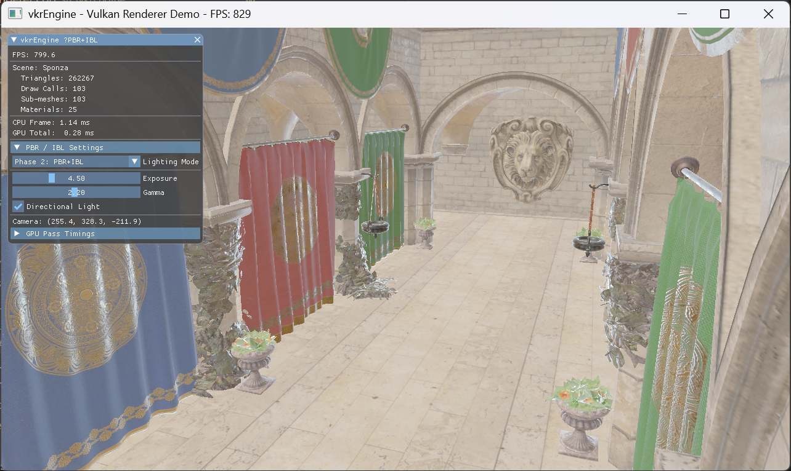

# Phase 2: PBR + IBL 集成 — 开发日志

## 1. 最终渲染效果



---

## 2. 目标

从 Phase 1 的 ambient + Lambertian diffuse 升级到完整的 PBR 管线：
- **Cook-Torrance GGX** 微表面 BRDF（D/F/G 三项）
- **IBL 环境光照**：HDR 环境贴图烘焙为 Irradiance Map + Prefiltered EnvMap + BRDF LUT
- **法线贴图**：切线空间 TBN 变换
- **HDR Tonemapping**：Uncharted2 + Exposure + Gamma 控制

---

## 3. 架构变更（Phase 1 —— Phase 2）

| 维度            | Phase 1                               | Phase 2                                            |
| --------------- | ------------------------------------- | -------------------------------------------------- |
| BRDF            | 无 (ambient + lambertian diffuse)     | Cook-Torrance GGX (D/F/G)                          |
| 环境光          | 常量 `(0.06, 0.06, 0.08)`             | IBL: Irradiance Cubemap × albedo                   |
| 高光            | 无                                    | Prefiltered EnvMap × (F·brdf.x + brdf.y)           |
| 法线贴图        | 未使用                                | Tangent-space TBN, 法线映射                        |
| Tonemapping     | Reinhard                              | Uncharted2 (HDR —— LDR) + Exposure                 |
| 纹理格式        | 全部 sRGB                             | baseColor —— sRGB, normal/MR —— UNORM (linear)     |
| Descriptor Set0 | SceneUBO (1 binding)                  | SceneUBO + 3 IBL samplers + ParamsUBO (5 bindings) |
| Descriptor Set1 | baseColorImage + sampler (2 bindings) | 3 images + sampler + MaterialUBO (5 bindings)      |
| UI 控制         | 基本信息                              | LightingMode 切换 + Exposure/Gamma + DirLight      |

### Descriptor 布局详情

```
Set 0 (整个场景，每帧使用):
  Binding 0: SceneUBO              (UniformBuffer)
  Binding 1: Irradiance Cubemap    (CombinedImageSampler)
  Binding 2: Prefiltered EnvMap    (CombinedImageSampler)
  Binding 3: BRDF LUT              (CombinedImageSampler)
  Binding 4: ParamsUBO             (UniformBuffer: exposure/gamma/lightingMode/enableDirLight)

Set 1 (逐材质):
  Binding 0: baseColorTexture      (SampledImage, sRGB)
  Binding 1: normalTexture         (SampledImage, UNORM)
  Binding 2: metallicRoughnessTex  (SampledImage, UNORM)
  Binding 3: sharedSampler         (Sampler, anisotropic)
  Binding 4: MaterialUBO           (UniformBuffer: factors + texture flags)

Push Constant: modelMatrix (mat4, 64 bytes)
```

---

## 4. IBL 烘焙流程

```
newport_loft.hdr (equirect)
  | filtercube.spv: 6× Render —— 512×512 RGBA16F
Env Cubemap
  | irradiancecube.spv: 6× Render —— 64×64 RGBA16F
Irradiance Cubemap (diffuse IBL)
  | prefilterenvmap.spv: 6×6 mip Render —— 512×512 RGBA16F (10 mip levels)
Prefiltered EnvMap (specular IBL)
  | genbrdflut.spv: 1× fullscreen draw —— 512×512 RGBA16F
BRDF LUT (NdotV × roughness —— F0 scale + bias)
```

- 环境贴图: `newport_loft.hdr`（assets/textures/）
- IBL 的烘焙通过一次 command buffer 完成初始化
- IBL shader 复用 `shaders/3_pbr_ibl/` 下的已有实现

---

## 5. A/B 对比功能

通过 UI 中 **Lighting Mode** 下拉框切换：

| 模式             | 光照方式                                     | Tonemapping |
| ---------------- | -------------------------------------------- | ----------- |
| Phase 1: Simple  | 常量 ambient + lambertian diffuse            | Reinhard    |
| Phase 2: PBR+IBL | IBL ambient + IBL specular + GGX directional | Uncharted2  |

配套控件: **Exposure** (0.1–15.0), **Gamma** (0.5–4.0), **Directional Light** 开关

---

## 6. 实现要点 & 踩坑记录

### 6.1 纹理格式：sRGB 对比 UNORM

#### 问题
PBR 材质看起来"发灰"，金属感不足。

#### 分析
baseColor 纹理包含 sRGB 编码的颜色数据，但 Vulkan 默认按 linear 采样 —— 颜色偏暗。法线贴图和 metallicRoughness 贴图存储的是线性数据，不能做 sRGB 转换。

#### 解决
```cpp
// baseColor —— VK_FORMAT_R8G8B8A8_SRGB  (GPU 自动 sRGB——linear)
// normal/mr —— VK_FORMAT_R8G8B8A8_UNORM  (直接读取)
```

### 6.2 法线贴图：切线空间 TBN

#### 问题
法线贴图启用后凹凸方向不正确。

#### 分析
TBN 矩阵构建需要正确处理 Bitangent 方向。glTF 规范中 `tangent.w` 存储 bitangent 的符号。

#### 代码
```hlsl
float3 T = normalize(input.tangent);
float3 B = normalize(input.bitangent);
float3 Ng = normalize(input.normal);
// tangent.w 控制 bitangent 方向
output.bitangent = cross(output.normal, output.tangent) * tangent.w;
```

### 6.3 材质 PBR 参数

Sponza 的材质偏 diffuse（metallic≈0, roughness≈1），PBR 效果接近 Lambertian：
- `metallic = mrSample.x * materialUbo.metallicFactor`
- `roughness = max(mrSample.y * materialUbo.roughnessFactor, 0.04)` — 避免除零

### 6.4 IBL 合并公式

```hlsl
// 能量守恒：金属度越高，diffuse 贡献越低
float3 kD = (1.0 - F) * (1.0 - metallic);
float3 ambient = kD * diffuseIBL + specularIBL;
```

---

## 7. 已知限制 & 后续改进

| 问题                  | 说明                                             | 后续              |
| --------------------- | ------------------------------------------------ | ----------------- |
| Sponza 材质偏 diffuse | metallic≈0, roughness≈1 —— PBR 退化为 Lambertian | Bistro 场景有金属 |
| 方向光硬编码          | 方向、颜色固定                                   | Phase 3 CSM       |
| 无阴影                | 无遮挡信息                                       | Phase 3 CSM       |
| 无点光源              | 只有方向光                                       | Phase 5 Clustered |
| IBL 贴图固定          | 不可运行时切换                                   | Phase 6 后处理    |

---

## 8. 下一步

[Phase 3: CSM 级联阴影映射](03_phase3_csm.md)
