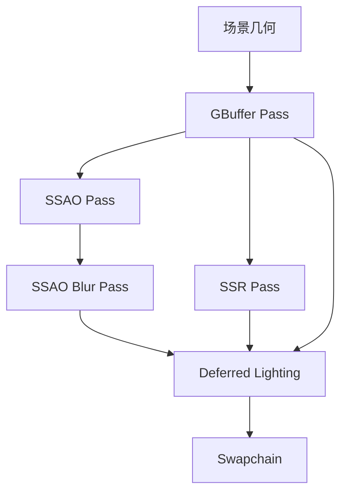

# Phase 4: 延迟渲染 + SSAO + SSR

> 日期: 2026-06-02
> 模块: vkrEngine
> 状态: 🟢 已完成

---

## 1. 功能概述

**目标**：将 vkrEngine 从纯前向渲染管线升级为延迟渲染管线，在此基础上集成 SSAO（屏幕空间环境光遮蔽）和 SSR（屏幕空间反射），提升画面真实感。

**数据流**：
```
[场景几何] → GBuffer Pass (MRT) → SSAO Pass → SSAO Blur → SSR Pass → Deferred Lighting → Swapchain
                                      ↑                            ↑
                                   GBuffer(N, D)              GBuffer(N, D, Color)
```

**预期效果**：
- 延迟渲染使光照计算与几何复杂度解耦，为后续 Clustered Shading 打基础
- SSAO 增加接触阴影，提升场景深度感
- SSR 在光滑表面提供实时反射，增强金属/水面材质表现
- Debug Views 方便逐 Pass 排查渲染问题

---

## 2. 方案对比

### 方案 A：完全替换前向管线为延迟管线
- **思路**：删除所有前向渲染代码，只保留延迟路径
- **优点**：代码简洁，无冗余路径
- **缺点**：丧失与前向渲染的 A/B 对比能力；调试时无法回退到已知良好的前向结果
- **结论**：❌ 放弃。保留前向管线作为参考基准价值更高。

### 方案 B：延迟 + 前向双管线共存（最终采用）
- **思路**：GBuffer/SSAO/SSR/Deferred 作为新增 Pass，通过 UI 开关控制走前向还是延迟路径；前向渲染代码完整保留
- **优点**：可实时切换对比；渐进式集成，风险可控
- **缺点**：代码量较大，`VkrRenderer` 类膨胀
- **结论**：✅ 选用。开发阶段双管线便于验证延迟渲染正确性。

### 方案 C：SSAO/SSR 作为独立 Compute Pass
- **思路**：SSAO 和 SSR 用 compute shader 实现（而非 full-screen triangle + fragment shader）
- **优点**：compute shader 对 shared memory 和 wavefront 利用更优
- **缺点**：与现有 full-screen triangle 管线风格不一致；需要额外的 storage image 管理
- **结论**：❌ 放弃。当前阶段所有 Pass 统一用 full-screen triangle + fragment shader，保持管线一致性，后续可优化为 compute。

### GBuffer 格式选型

| 候选格式            | 每像素字节 | 精度             | 结论   |
| ------------------- | ---------- | ---------------- | ------ |
| R8G8B8A8 UNORM      | 4B         | 低，banding 明显 | ❌      |
| R16G16B16A16 SFLOAT | 8B         | 高，HDR 友好     | ✅ 选用 |
| R32G32B32A32 SFLOAT | 16B        | 过高，带宽浪费   | ❌      |

最终 GBuffer 布局：
- **Albedo**: R16G16B16A16 SFLOAT（RGB=albedo, A=unused）
- **Normal+Roughness**: R16G16B16A16 SFLOAT（RGB=世界空间法线, A=roughness）
- **PBR**: R16G16B16A16 SFLOAT（R=metallic, G=occlusion, B=unused, A=unused）
- **Depth**: D32 SFLOAT（硬件深度，无颜色附件）

---

## 3. 架构设计

### 管线流程



### Descriptor Set 布局

**Set 0 — Scene-level（所有 Pass 共享）**：

| Binding | 类型                   | 内容                                                                               |
| ------- | ---------------------- | ---------------------------------------------------------------------------------- |
| 0       | UBO                    | SceneUBO（projection, view, invProjection, invView, camPos, lightDir, lightColor） |
| 1       | Combined Image Sampler | Irradiance Cubemap（IBL diffuse）                                                  |
| 2       | Combined Image Sampler | Prefiltered Environment Map（IBL specular）                                        |
| 3       | Combined Image Sampler | BRDF LUT（2D）                                                                     |
| 4       | UBO                    | ParamsUBO（exposure, gamma, lightingMode, enableDirLight）                         |
| 5       | UBO                    | CsmUBO（4×cascadeViewProj, cascadeSplitDepths）                                    |
| 6       | Combined Image Sampler | Shadow Map Array（CSM 深度）                                                       |
| 7       | UBO                    | ShadowParamsUBO（filterMode, pcfRadius, pcssLightSize, bias）                      |

**Set 1 — GBuffer Input（Deferred Lighting Pass）**：

| Binding | 类型          | 内容                                                      |
| ------- | ------------- | --------------------------------------------------------- |
| 0       | Sampled Image | GBuffer Albedo                                            |
| 1       | Sampled Image | GBuffer Normal + Roughness                                |
| 2       | Sampled Image | GBuffer PBR (metallic, occlusion)                         |
| 3       | Sampled Image | GBuffer Depth                                             |
| 4       | Sampled Image | SSAO（模糊后）                                            |
| 5       | Sampled Image | SSR Reflection                                            |
| 6       | UBO           | DeferredSettingsUBO（ssaoEnabled, ssrEnabled, debugView） |

**独立 Pass 的专属 Descriptor Set**：

| Pass      | Set   | 绑定内容                                                      |
| --------- | ----- | ------------------------------------------------------------- |
| GBuffer   | Set 1 | Material textures + MaterialUBO（复用前向管线）               |
| SSAO      | Set 0 | SSAOSettingsUBO + GBuffer Normal/Depth 采样器 + Noise Texture |
| SSAO Blur | Set 0 | BlurUBO + SSAO Raw 采样器                                     |
| SSR       | Set 0 | SceneUBO + GBuffer Depth/Color/Normal 采样器 + SSRParams UBO  |

### Shader 列表

| Shader            | 文件                                           | 入口                | 用途                                |
| ----------------- | ---------------------------------------------- | ------------------- | ----------------------------------- |
| deferred_gbuffer  | `shaders/15_vkrEngine/deferred_gbuffer.slang`  | vertMain / fragMain | 几何体 → GBuffer MRT                |
| ssao              | `shaders/15_vkrEngine/ssao.slang`              | vertMain / fragMain | 全屏三角形 → SSAO 原始值            |
| ssao_blur         | `shaders/15_vkrEngine/ssao_blur.slang`         | vertMain / fragMain | 9-tap 双边模糊                      |
| ssr               | `shaders/15_vkrEngine/ssr.slang`               | vertMain / fragMain | 视空间 raymarching SSR              |
| deferred_lighting | `shaders/15_vkrEngine/deferred_lighting.slang` | vertMain / fragMain | GBuffer 组装 + PBR+IBL+CSM+SSAO+SSR |

### SceneUBO 扩展

Phase 4 在原有 SceneUBO 基础上增加了两个逆矩阵：

```cpp
struct SceneUBO {
    glm::mat4 projection;
    glm::mat4 view;
    glm::mat4 invProjection;  // 新增：NDC→视空间重建（SSAO/SSR 需要）
    glm::mat4 invView;         // 新增：视空间→世界空间（SSAO 需要）
    glm::vec4 camPos;
    glm::vec4 lightDir;
    glm::vec4 lightColor;
};
```

---

## 4. 实现细节

### 关键文件

| 文件                                           | 作用                                                    |
| ---------------------------------------------- | ------------------------------------------------------- |
| `src/vkrEngine/VkrRenderer.h`                  | 所有 Phase 4 UBO 结构体定义 + GBuffer/SSAO/SSR 资源声明 |
| `src/vkrEngine/VkrRenderer.cpp`                | Phase 4 全部实现（~1000 行新增代码）                    |
| `shaders/15_vkrEngine/deferred_gbuffer.slang`  | GBuffer 顶点/片元着色器                                 |
| `shaders/15_vkrEngine/ssao.slang`              | SSAO 全屏 Pass                                          |
| `shaders/15_vkrEngine/ssao_blur.slang`         | SSAO 9-tap 双边模糊                                     |
| `shaders/15_vkrEngine/ssr.slang`               | SSR 视空间 raymarching                                  |
| `shaders/15_vkrEngine/deferred_lighting.slang` | 延迟光照：组装 GBuffer + 各效果                         |

### 技术要点

#### 1. GBuffer 深度重建
- SSAO 和 SSR 都依赖从深度缓冲重建视空间坐标
- 关键细节：**Vulkan NDC Z 是 [0,1]，不是 [-1,1]**
- 重建公式：`viewPos = invProjection * (uv*2-1, depth, 1)` 然后透视除法
- 不需要 `depth*2-1` 映射——这是常见错误来源

#### 2. SSAO 实现
- **采样核**：16 个半球的随机方向（预计算存储在 UBO 中）
- **旋转噪声**：4×4 噪声纹理平铺到屏幕，确保低样本数也不产生条带
- **范围检查**：深度差超过阈值的采样点不计入遮挡（避免错误遮挡）
- **双边模糊**：9-tap，基于深度和法线差异的 edge-preserving blur
- **7 种 Debug View**：0=正常, 1=视空间深度热力图, 2=世界法线, 3=噪声图案, 4=遮挡计数, 5=深度不连续性, 6=重建 viewPos.z

#### 3. SSR 实现
- **视空间 raymarching**：从片元位置沿反射方向步进
- **Roughness fade**：粗糙度越高，反射越模糊且 fade 越早
- **Binary refinement**：粗步进找到交点后，二分精确定位
- **Jitter**：每步引入哈希随机偏移，减少条带 artifact
- **Debug Modes**：0=最终, 1=hit/miss, 2=步数热力图, 3=深度, 4=法线

#### 4. Deferred Lighting
- Full-screen triangle 读取所有 GBuffer 通道
- 复用 Phase 2 的 Cook-Torrance GGX BRDF + IBL
- 复用 Phase 3 的 CSM 阴影计算（级联选择 + PCF/PCSS）
- SSAO 和 SSR 通过 `DeferredSettingsUBO` 独立 toggle

#### 5. UI 控制面板
```
[SSAO]
  Enabled ☑         Radius: 1.5     Bias: 0.025    Intensity: 1.0

[SSR]
  Enabled ☑         MaxDist: 16.0   Thickness: 0.12  Stride: 0.05
  Intensity: 1.0    MaxSteps: 85

[Debug View]
  ○ Final  ○ Albedo  ○ Normal  ○ PBR  ○ Depth
```

### 性能考量

- GBuffer 使用 R16G16B16A16 格式，每像素 32B（4 attachments），在 1080p 下约 8MB VRAM
- SSAO 和 SSR 都运行在半分辨率（性能 vs 质量待后续调优）
- 所有全屏 Pass 使用 single triangle with out-of-bounds vertices（无 vertex buffer）
- GBuffer Pass 的 MRT 写入受 ROP 带宽限制，是当前瓶颈

---

## 5. 已知问题与后续计划

### 局限性

- **SSR 屏幕边缘 artifact**：反射 ray 超出屏幕空间后丢失信息，边缘有明显的 fade-out。后续可配合 cubemap fallback 改善
- **SSAO 远距离轻微 halo**：远处物体周围有微弱亮边，可通过调整 bias 和 blur 半径缓解
- **半分辨率质量**：SSAO/SSR 在半分辨率运行，放大后有轻微模糊；全分辨率选项待实现
- **GBuffer 带宽**：R16G16B16A16 × 4 = 128 bpp，移动端不友好。后续可考虑压缩格式（如 R8G8B8A8 用于 Albedo）
- **前向/延迟切换**：切换时需要重建 swapchain（因为前向用 swapchain image 直接渲染，延迟用 GBuffer），当前实现为一次性初始化

### TODO / 后续优化

- [ ] SSAO compute shader 版本（利用 group shared memory 加速）
- [ ] SSR cubemap fallback（解决屏幕边缘缺失）
- [ ] Hi-Z trace 替代 linear raymarching（提升 SSR 性能）
- [ ] 全分辨率 SSAO/SSR 选项
- [ ] GBuffer 深度预 Pass（减少 overdraw）

### 关联的调试记录

- （暂无——Phase 4 开发过程中如有 Bug 修复，请用 `debug-log` Skill 记录于此目录）

---

## 变更摘要

| 类别                       | 变更                                                                                              |
| -------------------------- | ------------------------------------------------------------------------------------------------- |
| 新增 Shader                | `deferred_gbuffer.slang`, `ssao.slang`, `ssao_blur.slang`, `ssr.slang`, `deferred_lighting.slang` |
| 新增 UBO                   | `DeferredSettingsUBO`, `SSAOSettingsUBO`, `BlurUBO`, `SSRParams`                                  |
| 扩展 UBO                   | `SceneUBO` 增加 `invProjection`, `invView`                                                        |
| 新增 Descriptor Set Layout | GBuffer(Set 1 input), SSAO, SSAO Blur, SSR, Deferred Lighting                                     |
| 新增 Render Pass           | GBuffer(4×MRT), SSAO(1×color), SSAO Blur(1×color), SSR(1×color)                                   |
| UI 新增                    | SSAO 面板 + SSR 面板 + Debug View 单选                                                            |
| 代码量                     | `VkrRenderer.h` +~80 行, `VkrRenderer.cpp` +~1000 行                                              |
