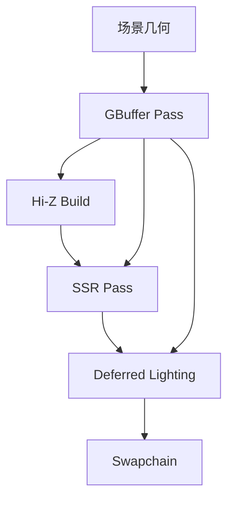

# Phase 4: 延迟渲染 + SSR

## 1. 功能概述

**目标**：从前向渲染管线改为延迟渲染管线，加入 SSR（屏幕空间反射），提升画面真实感。

**数据流 (含 Phase 5 扩展)：
```
[场景几何] → GBuffer Pass (MRT) → Hi-Z Build → SSR Pass → Deferred Lighting → Swapchain
                                    ↑                          ↑
                                 GBuffer(N, D)            GBuffer(N, D, Color)
                                                           ↑ Set 2: cluster lights (Phase 5)
```

## 2. 已移除功能

### SSAO（已移除 2026-06-08）
- 移除了 SSAO Pass、SSAO Blur Pass 及相关代码
- 移除了 `ssao.slang`、`ssao_blur.slang` 及其编译产物
- 移除了 `SSAOSettingsUBO`、`BlurUBO` 及所有 SSAO UI 参数
- `DeferredSettingsUBO::ssaoEnabled` 固定为 `0.0f`
- Ambient occlusion 改为直接使用 GBuffer 的 `ao` 值，不再采样 SSAO 纹理

### 方案 A：完全替换前向管线为延迟管线
- **思路**：删除所有前向渲染代码，只保留延迟路径
- **优点**：代码简洁，无冗余路径
- **缺点**：丧失与前向渲染的 A/B 对比能力；调试时无法回退到已知良好的前向结果
- **结论**：放弃。保留前向管线作为参考基准价值更高。

### 方案 B：延迟 + 前向双管线共存（最终采用）
- **思路**：GBuffer/SSR/Deferred 作为新增 Pass，通过 UI 开关控制走前向还是延迟路径；前向渲染代码完整保留
- **优点**：可实时切换对比；渐进式集成，风险可控
- **缺点**：代码量较大，`VkrRenderer` 类膨胀
- **结论**：选用。开发阶段双管线便于验证延迟渲染正确性。

### 方案 C：SSR 作为独立 Compute Pass
- **思路**：SSR 用 compute shader 实现（而非 full-screen triangle + fragment shader）
- **优点**：compute shader 对 shared memory 和 wavefront 利用更优
- **缺点**：与现有 full-screen triangle 管线风格不一致；需要额外的 storage image 管理
- **结论**：放弃。当前阶段所有 Pass 统一用 full-screen triangle + fragment shader，保持管线一致性，后续可优化为 compute。

### GBuffer 格式选型

| 候选格式            | 每像素字节 | 精度             | 结论   |
| ------------------- | ---------- | ---------------- | ------ |
| R8G8B8A8 UNORM      | 4B         | 低，banding 明显 | ❌      |
| R16G16B16A16 SFLOAT | 8B         | 高，HDR 友好     | ✅ 选用 |
| R32G32B32A32 SFLOAT | 16B        | 过高，带宽浪费   | ❌      |

最终 GBuffer 布局：
- **Albedo**: R16G16B16A16 SFLOAT（RGB=albedo, A=unused）
- **Normal+Roughness**: R16G16B16A16 SFLOAT（RGB=世界空间法线, A=roughness）
- **PBR**: R16G16B16A16 SFLOAT（R=metallic, G=occlusion, B=unused, A=unused）
- **Depth**: D32 SFLOAT（硬件深度，无颜色附件）

---

## 3. 架构设计

### 管线流程



### Descriptor Set 布局

**Set 0 — Scene-level（所有 Pass 共享）**：

| Binding | 类型                   | 内容                                                                               |
| ------- | ---------------------- | ---------------------------------------------------------------------------------- |
| 0       | UBO                    | SceneUBO（projection, view, invProjection, invView, camPos, lightDir, lightColor） |
| 1       | Combined Image Sampler | Irradiance Cubemap（IBL diffuse）                                                  |
| 2       | Combined Image Sampler | Prefiltered Environment Map（IBL specular）                                        |
| 3       | Combined Image Sampler | BRDF LUT（2D）                                                                     |
| 4       | UBO                    | ParamsUBO（exposure, gamma, lightingMode, enableDirLight）                         |
| 5       | UBO                    | CsmUBO（4×cascadeViewProj, cascadeSplitDepths）                                    |
| 6       | Combined Image Sampler | Shadow Map Array（CSM 深度）                                                       |
| 7       | UBO                    | ShadowParamsUBO（filterMode, pcfRadius, pcssLightSize, bias）                      |

**Set 1 — GBuffer Input（Deferred Lighting Pass）**：

| Binding | 类型          | 内容                                             |
| ------- | ------------- | ------------------------------------------------ |
| 0       | Sampled Image | GBuffer Albedo                                   |
| 1       | Sampled Image | GBuffer Normal + Roughness                       |
| 2       | Sampled Image | GBuffer PBR (metallic, occlusion)                |
| 3       | Sampled Image | GBuffer Depth                                    |
| 4       | Sampled Image | SSR Reflection                                   |
| 5       | UBO           | DeferredSettingsUBO（ssrEnabled, ssaoEnabled=0） |

**独立 Pass 的专属 Descriptor Set**：

| Pass    | Set   | 绑定内容                                                     |
| ------- | ----- | ------------------------------------------------------------ |
| GBuffer | Set 1 | Material textures + MaterialUBO（复用前向管线）              |
| SSR     | Set 0 | SceneUBO + GBuffer Depth/Color/Normal 采样器 + SSRParams UBO |
| Hi-Z    | Set 0 | Hi-Z 输入/输出 Image + 场景 UBO                              |
| Culling | Set 0 | Hi-Z + frustum/culling params + instance data                |

### Shader 列表

| Shader            | 文件                                             | 入口                | 用途                           |
| ----------------- | ------------------------------------------------ | ------------------- | ------------------------------ |
| deferred_gbuffer  | `shaders/15_vkrEngine/deferred_gbuffer.slang`    | vertMain / fragMain | 几何体 → GBuffer MRT           |
| ssr               | `shaders/15_vkrEngine/ssr.slang`                 | vertMain / fragMain | 视空间 raymarching SSR         |
| deferred_lighting | `shaders/15_vkrEngine/deferred_lighting.slang`   | vertMain / fragMain | GBuffer 组装 + PBR+IBL+CSM+SSR |
| hiz_build         | `shaders/15_vkrEngine/hiz_build.slang`           | compMain            | Hi-Z mipmap 构建               |
| occlusion_cull    | `shaders/15_vkrEngine/occlusion_cull_comp.slang` | compMain            | GPU 遮挡剔除                   |
| vkr_cluster       | `shaders/15_vkrEngine/vkr_cluster_comp.slang`    | compMain            | Clustered Shading 光源分配     |

### SceneUBO 扩展

Phase 4 在原有 SceneUBO 基础上增加了两个逆矩阵：

```cpp
struct SceneUBO {
    glm::mat4 projection;
    glm::mat4 view;
    glm::mat4 invProjection;  // 新增：NDC→视空间重建（SSR 需要）
    glm::mat4 invView;         // 新增：视空间→世界空间
    glm::vec4 camPos;
    glm::vec4 lightDir;
    glm::vec4 lightColor;
};
```

---

## 4. 实现细节

### 关键文件

| 文件                                           | 作用                                                         |
| ---------------------------------------------- | ------------------------------------------------------------ |
| `src/vkrEngine/VkrRenderer.h`                  | 所有 Phase 4/5 UBO 结构体定义 + GBuffer/SSR/Cluster 资源声明 |
| `src/vkrEngine/VkrRenderer.cpp`                | Phase 4/5 全部实现                                           |
| `shaders/15_vkrEngine/deferred_gbuffer.slang`  | GBuffer 顶点/片元着色器                                      |
| `shaders/15_vkrEngine/ssr.slang`               | SSR 视空间 raymarching                                       |
| `shaders/15_vkrEngine/deferred_lighting.slang` | 延迟光照：组装 GBuffer + 各效果                              |

### 技术要点

#### 1. GBuffer 深度重建
- SSR 依赖从深度缓冲重建视空间坐标
- 关键细节：**Vulkan NDC Z 是 [0,1]，不是 [-1,1]**
- 重建公式：`viewPos = invProjection * (uv*2-1, depth, 1)` 然后透视除法
- 不需要 `depth*2-1` 映射——这是常见错误来源

#### 2. SSR 实现
- **视空间 raymarching**：从片元位置沿反射方向步进
- **Roughness fade**：粗糙度越高，反射越模糊且 fade 越早
- **Binary refinement**：粗步进找到交点后，二分精确定位
- **Jitter**：每步引入哈希随机偏移，减少条带 artifact
- **Debug Modes**：0=最终, 1=hit/miss, 2=步数热力图, 3=深度, 4=法线

#### 3. Deferred Lighting
- Full-screen triangle 读取所有 GBuffer 通道
- 复用 Phase 2 的 Cook-Torrance GGX BRDF + IBL
- 复用 Phase 3 的 CSM 阴影计算（级联选择 + PCF/PCSS）
- Ambient occlusion 直接使用 GBuffer 的 `ao` 值（无需 SSAO pass）
- SSR 通过 `DeferredSettingsUBO` 独立 toggle

#### 4. UI 控制面板
```
[SSR]
  Enabled ☑         MaxDist: 16.0   Thickness: 0.12  Stride: 0.05
  Intensity: 1.0    MaxSteps: 85
```

### 性能考量

- GBuffer 使用 R16G16B16A16 格式，每像素 32B（4 attachments），在 1080p 下约 8MB VRAM
- SSR 运行在半分辨率（性能 vs 质量待后续调优）
- 所有全屏 Pass 使用 single triangle with out-of-bounds vertices（无 vertex buffer）
- GBuffer Pass 的 MRT 写入受 ROP 带宽限制，是当前瓶颈

---

## 5. 已知问题与后续计划

### 局限性

- **SSR 屏幕边缘 artifact**：反射 ray 超出屏幕空间后丢失信息，边缘有明显的 fade-out。后续可配合 cubemap fallback 改善
- **半分辨率质量**：SSR 在半分辨率运行，放大后有轻微模糊；全分辨率选项待实现
- **GBuffer 带宽**：R16G16B16A16 × 4 = 128 bpp，移动端不友好。后续可考虑压缩格式（如 R8G8B8A8 用于 Albedo）
- **前向/延迟切换**：切换时需要重建 swapchain（因为前向用 swapchain image 直接渲染，延迟用 GBuffer），当前实现为一次性初始化
- **无 SSAO**：环境遮蔽效果缺失，可考虑后续以更高效的方式重新引入

### TODO / 后续优化

- [ ] SSR cubemap fallback（解决屏幕边缘缺失）
- [ ] Hi-Z trace 替代 linear raymarching（提升 SSR 性能）
- [ ] 全分辨率 SSR 选项
- [ ] GBuffer 深度预 Pass（减少 overdraw）
- [ ] 高效 SSAO 方案（如果需要环境遮蔽）

---
