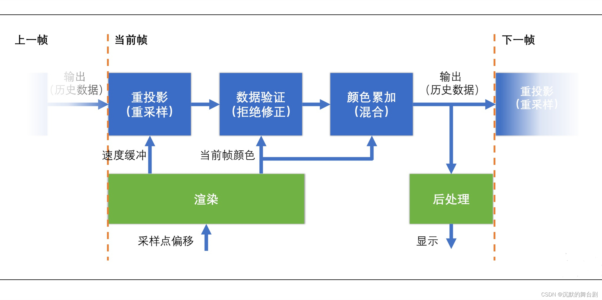

# TAAU（`RENDERING_LEVEL == 6`）完整流程说明

概括：TAAU 通过“低分辨率渲染 + 运动矢量重投影 + 历史帧自适应融合”，在保持较高性能的同时重建出更稳定、锯齿更少的全分辨率画面。

返回目录：[README.zh-CN.md](../../README.zh-CN.md)

渲染流程：

- Shadow Pass（深度）
- 主渲染 Color Pass（MRT：颜色 + 速度，低分辨率）
- TAAU Resolve Pass（全屏融合到 Swapchain）
- History 双缓冲更新

两个关键着色器（`shadow_lit_taau.slang` / `taau_resolve.slang`）。

---

## 1. 入口与关键文件

- 开关：`src/Core/RenderConfig.h`
  - `#define RENDERING_LEVEL 6`
- 关键文件：
  - `src/Core/Renderer_rendering.cpp`（每帧录制总流程）
  - `src/Core/Renderer_Shadow.cpp`（阴影与主渲染 UBO/实例数据更新）
  - `src/Core/Renderer_TAAU.cpp`（TAAU 资源、Descriptor、Pipeline、Resolve、UI）
  - `src/Core/Renderer.h`（Level 6 资源成员）
- 关键 Shader：
  - `shaders/shadow_lit_taau.slang`
  - `shaders/taau_resolve.slang`

---

## 2. Level 6 每帧渲染总流程

在 `Renderer_rendering.cpp` 中，Level 6 的主流程可概括为：

1. **Shadow Pass**（仅深度）
2. **主渲染 Pass（低分辨率 MRT）**
   - Color0: `taauInputColorData`
   - Color1: `taauVelocityData`（`R16G16_SFLOAT`）
   - Depth: `taauDepthData`
3. **TAAU Resolve Pass（全分辨率）**
   - 采样 current/history/velocity/depth
   - 输出到当前 swapchain 图像
4. **History 更新（Ping-Pong）**
   - 把本帧 resolve 结果拷贝到 history 写缓冲
   - 读写索引翻转
5. **UI Pass**
   - 在 swapchain 上叠加 ImGui

shadow pass + 2 个 color pass（主渲染 + resolve）。

---

## 3. Pass 1：Shadow Pass（阴影深度）

### 3.1 目标

生成阴影贴图（`shadowMapData`），供后续光照阶段采样。

### 3.2 关键点

- 渲染附件：
  - `colorAttachmentCount = 0`
  - 只有深度附件（shadow map）
- Pipeline：`shadowDepthPipeline`
- 结束后将 shadow map 布局转为 `ShaderReadOnlyOptimal`

---

## 4. Pass 2：主渲染 Color Pass（低分辨率 MRT）

>  TAAU 的“当前帧输入生成阶段”。

### 4.1 渲染目标（低分辨率）

低分辨率尺寸：

- `taauExtent = swapChainExtent * taauRenderScale`
- 例如 `1920x1080` * `0.67` => `1286x723`（取整且最小 1）

MRT 附件：

1. `taauInputColorData`（Color0）：当前帧低分辨率颜色
2. `taauVelocityData`（Color1）：当前帧屏幕空间速度
3. `taauDepthData`（Depth）：当前帧低分辨率深度

### 4.2 Pipeline

- 使用 `shadowLitPipeline` 作为主渲染 pipeline，其动态渲染颜色格式有 2 个：
  - `swapChainImageFormat`
  - `vk::Format::eR16G16Sfloat`

### 4.3 为什么必须有 velocity + depth

- `velocity`：把历史帧颜色重投影到当前像素（`historyUv = uv - velocity`）
- `depth`：当前实现仍会绑定给 resolve（便于后续扩展遮挡/几何置信度策略）

---

## 5. Pass 3：TAAU Resolve Pass（全屏合成到 Swapchain）

> “时域融合 + 上采样”的核心。

### 5.1 输入纹理与 UBO

`taau_resolve` descriptor 绑定：

- `binding 0`: `inputColorTex`（当前低分辨率颜色）
- `binding 1`: `historyColorTex`（历史全分辨率颜色）
- `binding 2`: `velocityTex`（低分辨率速度）
- `binding 3`: `depthTex`（低分辨率深度）
- `binding 4`: `TAAUParamsUBO`

### 5.2 输出

- Render target：当前 `swapChainImageViews[imageIndex]`
- 尺寸：全分辨率 `swapChainExtent`

### 5.3 开关逻辑

- `taauEnabled == false`
  - 不走 TAA resolve
  - 直接 `blit` 把低分辨率颜色线性放大到 swapchain
- `taauEnabled == true`
  - 走全屏 resolve shader，做历史融合

---

## 6. History 双缓冲（Ping-Pong）

### 6.1 资源

- `taauHistoryColorData[2]`：全分辨率历史颜色
- `taauHistoryReadIndex`：当前读历史索引
- `historyWrite = (historyRead + 1) % 2`

### 6.2 每帧步骤

1. 用 `historyRead` 参与 resolve
2. resolve 输出到 swapchain
3. swapchain 结果拷贝到 `historyWrite`
4. `taauHistoryReadIndex = historyWrite`
5. `taauHistoryValid = true`

### 6.3 冷启动与重置

- `taauHistoryValid == false` 时先初始化历史（避免读脏数据）
- `RenderScale` 改变后会重建资源并使历史失效
- UI 的 `Reset History` 也会触发重建累积

---

## 7. Jitter 与重投影基础

### 7.1 抖动来源

`updateTAAUBuffers()` 每帧使用 Halton 序列（2,3）生成 `taauJitterCurrent`，并保存 `taauJitterPrev`。

### 7.2 投影抖动注入

在 `updateShadowBuffers()` 中写入：

- `projection[2][0] += taauJitterCurrent.x * 2.0`
- `projection[2][1] += taauJitterCurrent.y * 2.0`

### 7.3 prevViewProj 更新

- `currentViewProj = projection * view`
- 每帧更新 `taauPrevViewProj`
- 提供给 `shadow_lit_taau.slang` 计算 motion vector

---

## 8. Shader 细节

## 8.1 `shadow_lit_taau.slang`（主渲染）

该 shader 在正常光照输出外，额外输出速度：

- 顶点阶段：
  - 当前裁剪坐标：`curClip = P * V * worldPos`
  - 历史裁剪坐标：`prevClip = prevViewProj * worldPos`
- 片元阶段：
  - `curNdc = curClip.xy / curClip.w`
  - `prevNdc = prevClip.xy / prevClip.w`
  - `velocity = (curNdc - prevNdc) * 0.5`

输出：

- `SV_TARGET0`：光照颜色
- `SV_TARGET1`：速度（xy）

---

## 8.2 `taau_resolve.slang`（时域融合 + 上采样）

当前实现重点如下：

0. **Jitter 前提（跨帧超采样基础）**
   - Resolve 本身不直接生成 jitter，jitter 来自 CPU 每帧注入到投影矩阵（Halton 序列）。
   - 由于每帧采样相位不同，`historyUV = uv - velocity` 的重投影融合才有意义，不然不同帧相同位置的像素值就完全一样，分摊多帧就没用了，抖动才能够逐帧提升边缘等效采样率。

1. **历史重投影**
   - `historyUV = clamp(uv - velocity, 0, 1)`
   - `historyColor = historyColorTex.Sample(historyUV)`

2. **3x3 邻域 Clamp**
   - 采样中心 + 8 邻域，得到当前帧局部颜色包络
   - 计算 `neighMin/neighMax`，并得到 `neighRange = neighMax - neighMin`
   - 用 `historyClampGamma` 按比例扩展包络（`expandedMin/expandedMax`）
   - 将历史颜色 `historyColor` clamp 到该包络，抑制错误历史（鬼影/拖尾）
   - `historyClampGamma` 的意义：
     - 值小：包络更窄，历史限制更强（残影更少，但更容易抖动/闪烁）
     - 值大：包络更宽，历史保留更多（画面更稳，但错误历史更容易混入）
   - 平衡 **历史稳定性** 和 **残影风险**

3. **仅颜色 + 速度拒绝（无 depth history reject）**
   - 当前版本不使用“历史深度差”作为 reject 条件，而是只基于颜色一致性和速度稳定性。
   - 主要拒绝信号是亮度差：
     - `lumaCurrent = dot(currentColor, float3(0.2126, 0.7152, 0.0722))`
     - `lumaHistory = dot(clampedHistory, float3(0.2126, 0.7152, 0.0722))`
     - `lumaDiff = abs(lumaCurrent - lumaHistory)`
   - reject 判定：
     - `rejectThreshold = historyRejectThreshold * lerp(0.75, 1.35, saturate(1.0 - stability))`
     - `colorReject = step(rejectThreshold, lumaDiff)`
   - 解释：
     - 当 `lumaDiff` 超过阈值，认为历史与当前不一致，触发拒绝（历史权重乘 `1 - colorReject`）。
     - 阈值会随着稳定度 `stability` 动态变化：稳定区域更严格保护细节，不稳定区域更强调抑制错误历史。
   - 速度参与方式：
     - 速度不直接做二值 reject，而是通过 `motionStability` 连续衰减历史权重，避免高速区域硬切换造成闪烁。

4. **自适应历史权重（静态区高、动态区低）**
   - 目标：让每个像素自己决定“该信多少历史”，而不是整帧统一权重。
   - 先计算 3 个稳定度分量：
     - `motionStability = saturate(1.0 - motionMag * 5.0)`（速度越大越不稳定）
     - `colorStability = saturate(1.0 - lumaDiff * (5.0 * reactiveClamp))`（颜色变化越大越不稳定）
     - `edgeStability = saturate(1.0 - edgeStrength * 0.9)`（强边缘越不稳定）
   - 然后组合为总稳定度：
     - `stability = motionStability * colorStability * edgeStability`
   - 用稳定度映射基础历史权重：
     - `historyWeight = lerp(minHistoryWeight, blendFactor, stability)`
   - 再做静态区域增强：
     - `staticBoost = saturate(stability * stability)`
     - `historyWeight = lerp(historyWeight, min(historyWeight + 0.14, 0.96), staticBoost)`
   - 结果含义：
     - 低运动 + 低变化 + 非强边缘：`historyWeight` 高，抗锯齿与时域稳定性更好。
     - 高运动/剧烈变化/强边缘：`historyWeight` 低，减少拖影与错误历史累积。

5. **运动自适应锐化**
   - 在 `taau_resolve.slang` 的末段，先得到时域融合后的颜色：
     - `blended = lerp(currentColor, clampedHistory, historyWeight)`
     - 再经 `antiFlicker`：`antiFlickerColor = lerp(currentColor, blended, flickerDamp)`
   - 然后不直接固定锐化强度，而是根据运动/边缘/稳定性构建抑制因子：
     - `motionSuppress = saturate(motionMag * 10.0)`
     - `edgeSuppress = saturate(edgeStrength * 0.9)`
     - `unstableSuppress = saturate(1.0 - stability)`
   - 三个抑制项共同决定锐化门控：
     - `sharpenGate = (1 - motionSuppress) * (1 - edgeSuppress) * (1 - unstableSuppress)`
     - `sharpenGate = saturate(sharpenGate)`
   - 最终锐化强度：
     - `sharpenAmount = lerp(0.005, 0.065, sharpenGate)`
     - `sharpened = sharpen(antiFlickerColor, n0, n1, n2, n3, sharpenAmount)`
   - 这意味着：
     - **高速运动区域**：`motionSuppress` 高，`sharpenGate` 低，几乎不锐化，避免把抖动/锯齿重新放大。
     - **强边缘区域**：`edgeSuppress` 高，抑制锐化，降低边缘闪烁与锯齿回弹。
     - **不稳定区域**（历史置信度低）：`unstableSuppress` 高，锐化自动减弱，避免时域噪声被增强。
     - **静止稳定区域**：三个 suppress 都低，`sharpenGate` 高，保留中等锐化以恢复细节。
   - 设计目的：
     - 避免“先 TAA 平滑，再被固定锐化把 aliasing 拉回来”。
     - 让锐化成为“有条件增强”，而不是全局恒定增强。

> 这一版的目标是：减少“历史过度拒绝导致锯齿回退”，并减少“锐化把 aliasing 重新拉出来”的问题。

---

## 9. 参数说明（`TAAUParamsUBO`）

- `blendFactor`
  - 历史基础占比。
  - 高：更稳、抗锯齿更强；过高可能拖影。

- `reactiveClamp`
  - 对亮度差敏感度（影响颜色稳定性判定）。
  - 高：变化区域更容易降 history；低：更偏向保留历史。

- `antiFlicker`
  - 抗闪烁插值强度。
  - 高：闪烁更少但可能偏软。

- `velocityScale`
  - 速度幅值缩放。
  - 用来匹配 motion vector 量纲；偏差会导致对齐错误。

- `historyClampGamma`
  - 邻域 clamp 包络扩展幅度。
  - 高：更宽松保细节；低：更保守防污染。

- `historyRejectThreshold`
  - 颜色差拒绝阈值。
  - 低：更激进拒绝（稳但可能闪）；高：更保留历史（稳态更平滑）。

---

## 10. UI 调试项（`TAAU Debug`）

- `Enable TAA Resolve`
- `BlendFactor`
- `ReactiveClamp`
- `AntiFlicker`
- `VelocityScale`
- `ClampGamma`
- `RejectThreshold`
- `RenderScale`（会重建 TAAU 资源并重置历史）
- `FreezeHistory`
- `Reset History`

建议调参顺序：

1. 固定 `RenderScale`（例如 0.67）
2. 先调 `blendFactor` / `historyRejectThreshold`
3. 再调 `reactiveClamp` / `historyClampGamma`
4. 最后微调 `antiFlicker` / `velocityScale`

---

## 11. 当前实现结论

`RENDERING_LEVEL == 6` 现在已经是完整可用的 TAAU 管线：

- 阴影深度 pass
- 低分辨率主渲染（颜色+速度+深度）
- 全分辨率时域 resolve
- history 双缓冲持续累积
- 自适应权重 + 3x3 clamp + 运动自适应锐化

---

## 12. 补充：`taau_resolve.slang` 顶点着色器中 `pos` / `uv` 的计算

本 pass 使用**全屏三角形（fullscreen triangle）**，不依赖顶点缓冲，而是通过 `SV_VertexID` 在顶点着色器里直接生成 3 个顶点。

对应代码逻辑（`vertMain`）：

- `vertexId == 0`：`pos = (-1,  1)`
- `vertexId == 1`：`pos = (-1, -3)`
- `vertexId == 2`：`pos = ( 3,  1)`

输出：

- `o.pos = float4(pos, 0.0, 1.0)`（裁剪空间坐标）
- `o.uv = pos * 0.5 + 0.5`（把 `[-1,1]` 区间线性映射到 `[0,1]`）

> 为什么是 `3` 和 `-3` ：用来构造全屏三角形：

- 三角形的两个点会落在标准 NDC 范围外（超出 `[-1,1]`）
- 但光栅化后可以完整覆盖整个屏幕
- 相比“全屏四边形（2 个三角形）”，这种方式更简单，也可避免对角线拼接处的插值差异问题
